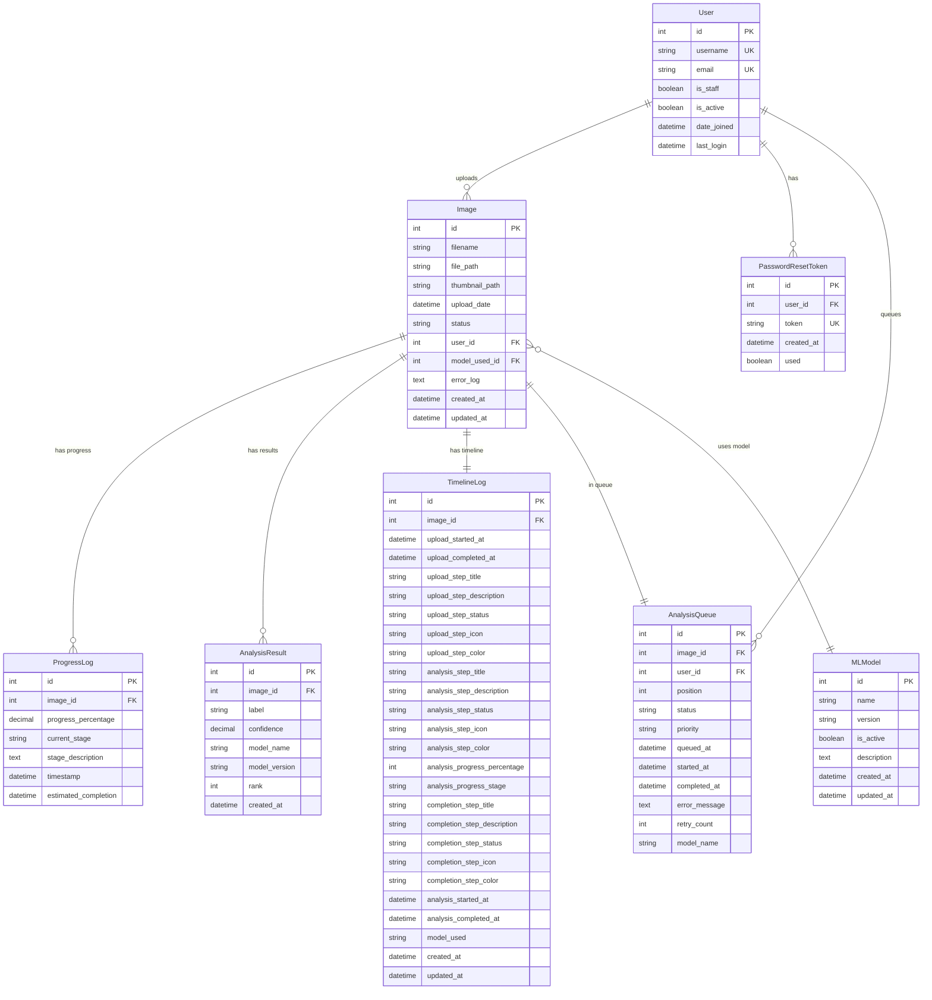

# データベース設計 ER図（Mermaid形式）

## テーブル関係図

## システム全体のフロー図

## データフロー図

## draw.ioでの作成手順

1. **draw.ioを開く**
2. **新しい図を作成**
3. **以下の手順でテーブルを作成**：
   - 左パネルから「Entity Relationship」または「Database」を選択
   - 各テーブルをドラッグ&ドロップ
   - テーブル名とフィールドを入力
   - 主キー（PK）、外部キー（FK）、一意制約（UK）を設定
   - テーブル間の関係線を描画

4. **推奨レイアウト**：
   - Userを中央上部に配置
   - Imageを中央に配置
   - 関連テーブルをImageの周りに配置
   - MLModelを右側に配置

5. **色分けの提案**：
   - User関連：青色
   - Image関連：緑色
   - ログ・結果関連：オレンジ色
   - キュー関連：紫色

この設計書とMermaid図を参考に、draw.ioで詳細なER図を作成できます。
