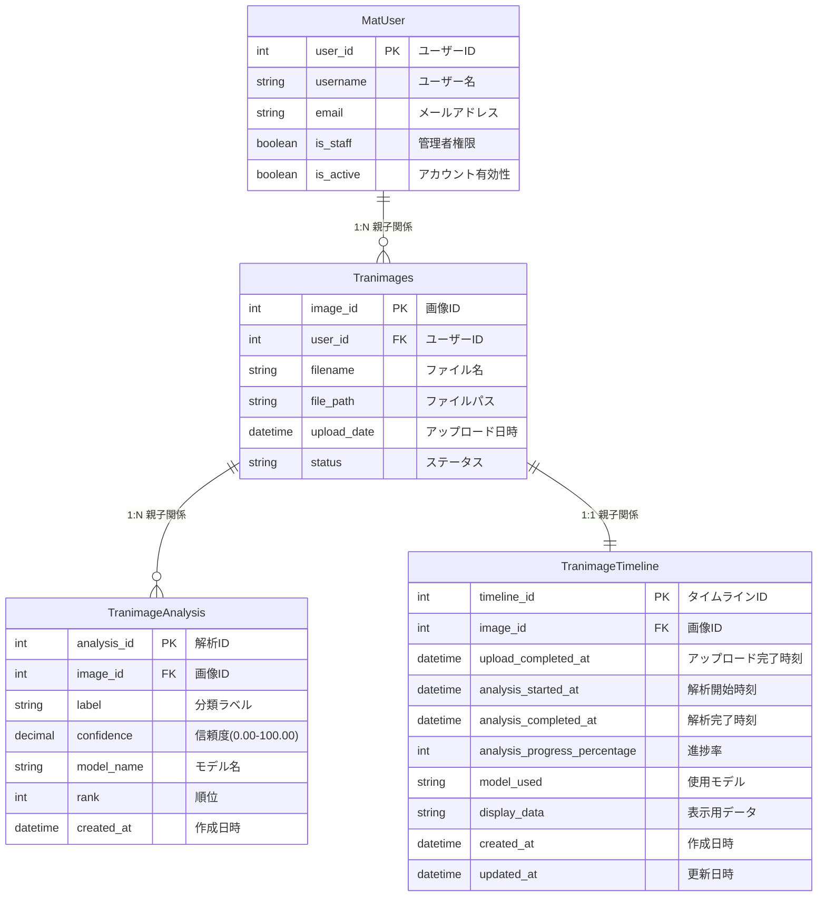

# データベース設計図（Mermaid形式）

## draw.ioインポート用ER図（縦表示）



## 親子関係の説明

### 階層構造
```
MatUser (親)
  └── Tranimages (子)
      ├── TranimageAnalysis (孫)
      └── TranimageTimeline (子、1:1)
```

### 関係の詳細
- **MatUser → Tranimages**: 1対多 親子関係（1つのユーザーが複数の画像をアップロード）
  - 親：MatUser
  - 子：Tranimages
  - 削除動作：CASCADE（親削除時、子も削除）

- **Tranimages → TranimageAnalysis**: 1対多 親子関係（1つの画像が複数の解析結果を持つ）
  - 親：Tranimages
  - 子：TranimageAnalysis
  - 削除動作：CASCADE（親削除時、子も削除）

- **Tranimages → TranimageTimeline**: 1対1 親子関係（1つの画像が1つのタイムラインを持つ）
  - 親：Tranimages
  - 子：TranimageTimeline
  - 削除動作：CASCADE（親削除時、子も削除）

## 横表示版（水平レイアウト）


## draw.ioでの使用方法

1. draw.ioにアクセス: https://app.diagrams.net/
2. 「Create New Diagram」を選択
3. 「Mermaid」を検索して選択
4. 上記のMermaidコードをコピー＆ペースト
5. 「Insert」をクリック
6. 自動的にER図が生成されます

## カスタマイズオプション

生成された図をdraw.ioで編集可能：
- 色の変更
- レイアウトの調整
- テキストの追加
- 関係線のスタイル変更
- 図形の移動・サイズ変更
