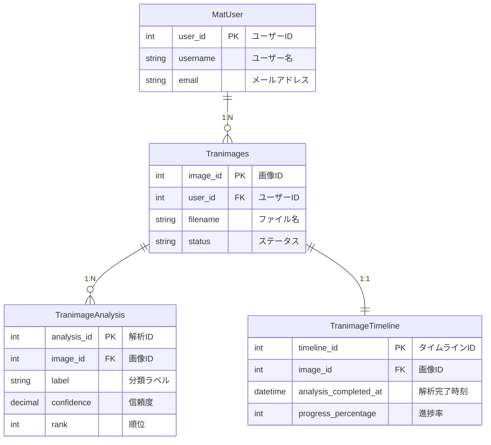

# シンプルER図（draw.io用）

## 最小構成版



## 超シンプル版（テーブル名のみ）

```mermaid
erDiagram
    %%{init: {"er": {"layoutDirection": "LEFT_TO_RIGHT"}}}%%
    MatUser {
        int user_id PK
        string username
        string email
    }
    
    Tranimages {
        int image_id PK
        int user_id FK
        string filename
    }
    
    TranimageAnalysis {
        int analysis_id PK
        int image_id FK
        string label
    }
    
    TranimageTimeline {
        int timeline_id PK
        int image_id FK
        datetime completed_at
    }
    
    MatUser ||--o{ Tranimages
    Tranimages ||--o{ TranimageAnalysis
    Tranimages ||--|| TranimageTimeline
```

## draw.ioでの使用方法

1. 上記のコードをコピー
2. [Mermaid Live Editor](https://mermaid.live/edit)で確認
3. draw.ioで「Mermaid」を選択してインポート
4. 必要に応じて手動でレイアウト調整

## 手動レイアウトのコツ

draw.ioでインポート後：
1. **テーブルを小さく** - フィールドを3-4個に絞る
2. **直線配置** - MatUser → Tranimages → TranimageAnalysis を一直線に
3. **TranimageTimeline** - Tranimagesの下に配置
4. **関係線を整理** - 不要な線を削除し、色を統一

