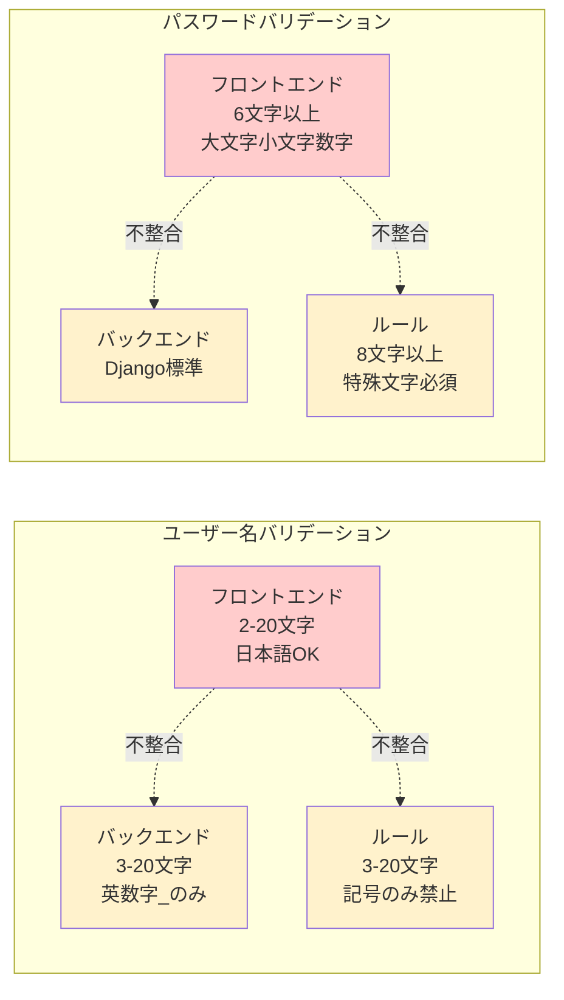
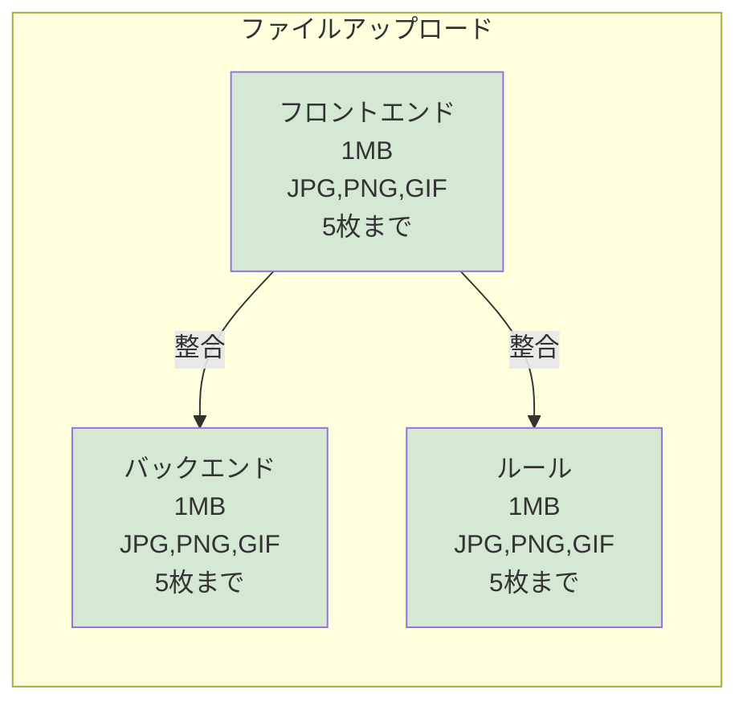
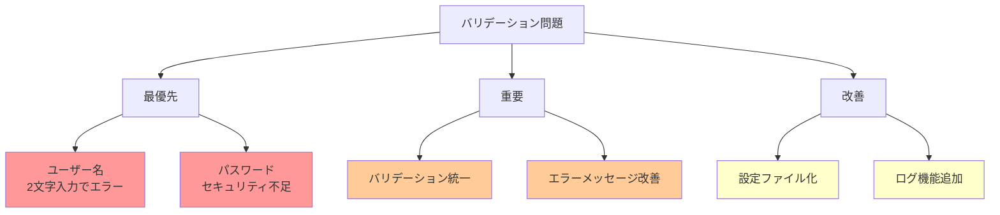
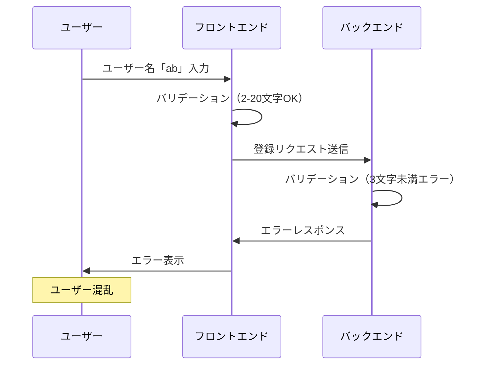
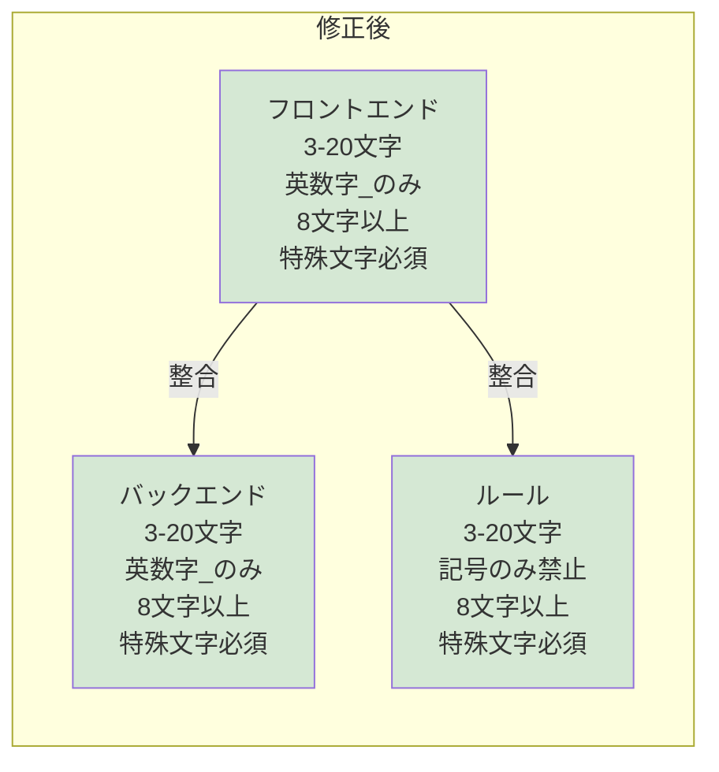

# バリデーション比較図（シンプル版）

## 1. 問題のあるバリデーション

## 2. 正常なバリデーション

## 3. 修正が必要な優先順位

## 4. 実際の問題シナリオ

## 5. 修正後の理想状態

## 使用方法

1. **Mermaid Live Editor**: https://mermaid.live/edit で確認
2. **プレゼンテーション**: 図を使って問題を説明
3. **ドキュメント**: READMEや仕様書に組み込み

これらの図は、複雑な表よりも視覚的に分かりやすく、問題点を明確に示しています。

