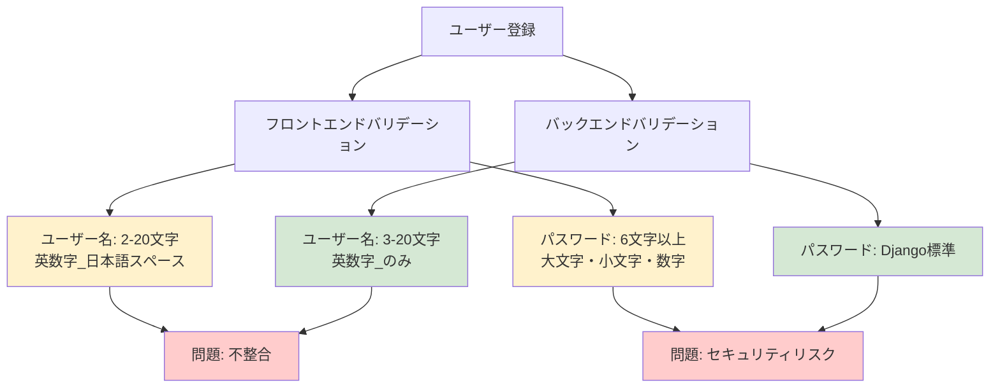
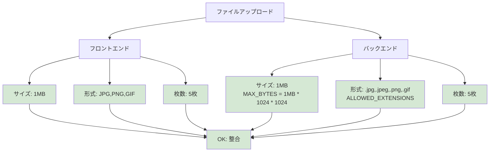
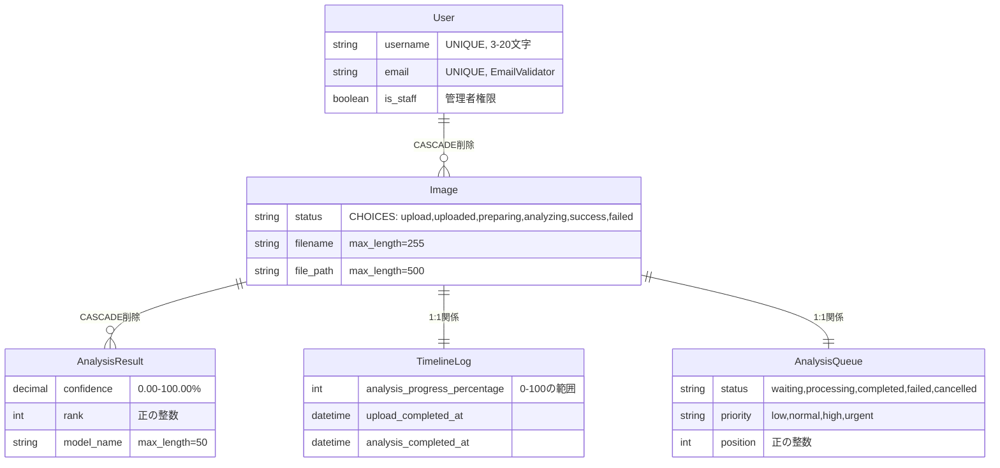
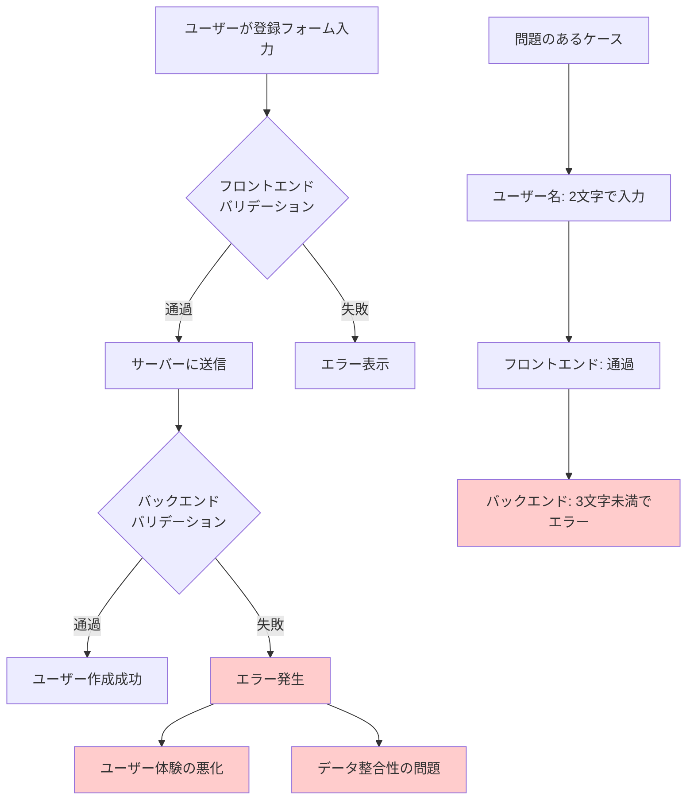
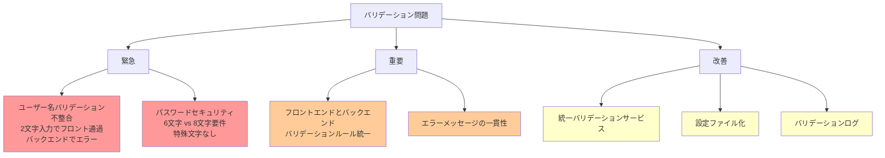
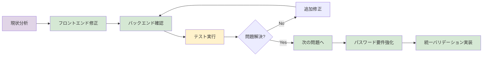
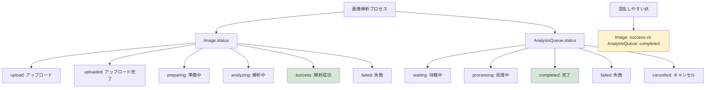

# バリデーションルール可視化図

## 1. ユーザー認証バリデーション比較

## 2. ファイルアップロードバリデーション

## 3. データベース制約関係図

## 4. バリデーション問題の影響フロー

## 5. 修正優先度マトリックス

## 6. 修正作業フロー

## 7. ステータス値の関係図

## 使用方法

1. **Mermaid Live Editor**: https://mermaid.live/edit で各図を確認
2. **draw.io**: 図をインポートして編集
3. **ドキュメント**: 各図をコピーしてドキュメントに貼り付け

各図は独立しており、用途に応じて使用できます。
